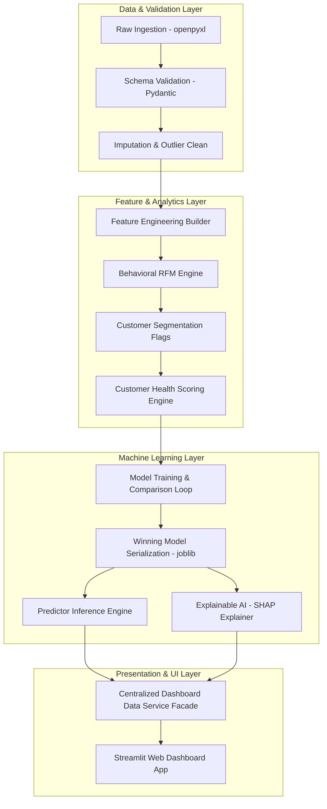
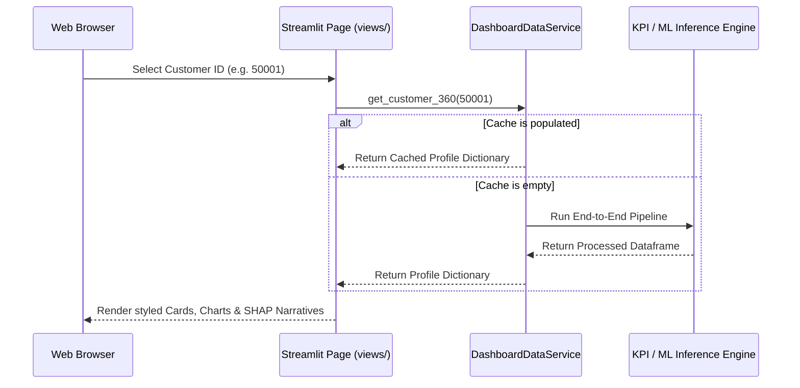
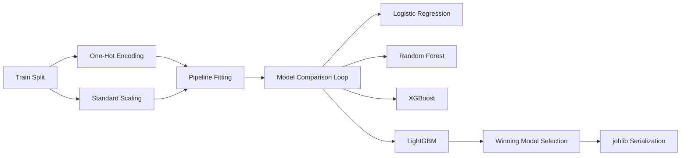
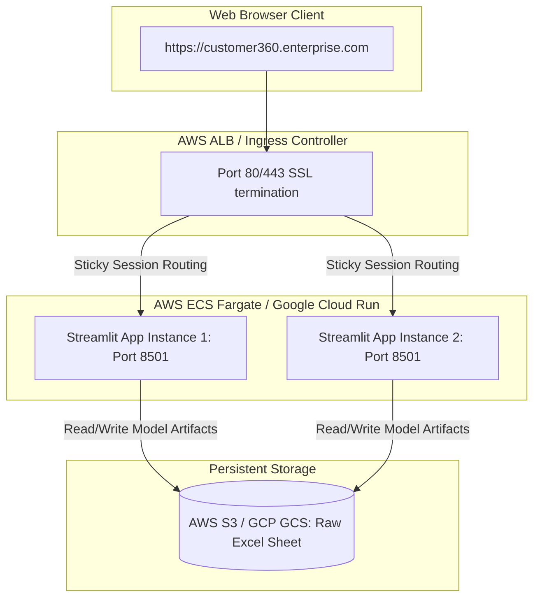

# 🏢 Enterprise Customer 360 Intelligence & Churn Analytics Platform

**A Fortune 500–Grade Analytical Engine for Customer Retention, Behavioral Segmentation, Churn Forecasting, and Explainable AI (XAI)**

---

[🚀 Live Demo Link](https://enterprise-customer-360-intelligence-churn-analytics-platform.streamlit.app) | [📂 Code Repository](https://github.com/rameez-1807/Enterprise-Customer-360-Intelligence-Churn-Analytics-Platform)

---

[](#ci-cd)
[](https://python.org)
[](https://enterprise-customer-360-intelligence-churn-analytics-platform.streamlit.app)
[](#machine-learning-pipeline)
[](#explainable-ai--local-explanations)
[](LICENSE)
[](#testing--quality-assurance)
[](https://github.com)
[](https://github.com)

---

## 📋 Table of Contents
- [Overview](#overview)
- [Business Problem & Solution](#business-problem--solution)
- [System Architecture](#system-architecture)
- [Decoupled Stack & Service Layer](#decoupled-stack--service-layer)
- [Data & Analytics Pipeline](#data--analytics-pipeline)
- [Machine Learning Pipeline](#machine-learning-pipeline)
- [Explainable AI & Local Explanations](#explainable-ai--local-explanations)
- [Folder Structure](#folder-structure)
- [Technology Stack](#technology-stack)
- [Getting Started & Installation](#getting-started--installation)
- [Running Locally](#running-locally)
- [Docker Containerization](#docker-containerization)
- [Deployment Architecture](#deployment-architecture)
- [API Reference](#api-reference)
- [Performance & Benchmarks](#performance--benchmarks)
- [Testing & Quality Assurance](#testing--quality-assurance)
- [Security Audits](#security-audits)
- [Roadmap & Future Improvements](#roadmap--future-improvements)
- [FAQ](#faq)
- [License](#license)
- [Author & Credits](#author--credits)
- [Contact](#contact)
- [Acknowledgements](#acknowledgements)

---

## Overview
The **Enterprise Customer 360 Intelligence & Churn Analytics Platform** is a production-grade analytical repository that transforms raw, transactional e-commerce customer datasets into business-ready operational profiles. 

This repository implements descriptive KPI calculations, customer health grading metrics, behavioral RFM segments, and machine learning models (LightGBM/XGBoost) combined with post-hoc SHAP (SHapley Additive exPlanations) explainability layers. All analytical services are served through a centralized dashboard data service cache, powering a role-based interactive Streamlit web dashboard.

---

## Business Problem & Solution

### The Business Problem
E-commerce enterprises lose significant revenue due to customer churn. Traditional customer success interventions are reactive, relying on lag indicators (e.g., historical purchases). To combat customer loss, organizations require a predictive warning system that identifies at-risk accounts, quantifies the primary churn drivers at an individual customer level, and prescribes targeted CRM campaign interventions.

### The Solution
This platform automates the end-to-end customer intelligence lifecycle:
- **Descriptive Analytics:** Evaluates customer satisfaction scores (CSAT), complaint ratios, and behavioral RFM cohorts to calculate a multi-dimensional Customer Health Score.
- **Predictive Modeling:** Deploys a LightGBM classifier optimized for recall to forecast customer churn (Recall: **`98.95%`**, F1-Score: **`94.95%`**).
- **Prescriptive Explainability:** Utilizes a local SHAP explainer to provide natural-language churn narratives, mapping specific playbook actions to risk tiers.

---

## System Architecture



---

## Decoupled Stack & Service Layer

The application utilizes a Service-Facade architectural pattern. The frontend displays are decoupled from computation logic. All pages access data via the `DashboardDataService` cached facade, which initializes the full pipeline once and caches the processed data mart in memory for O(1) response latency.



---

## Data & Analytics Pipeline

### Data Validation & Cleaning
The ingestion pipeline cleans the data:
- **Whitespace Stripping:** Trims whitespace from all text strings.
- **Category Normalization:** Standardizes categorical naming variations (e.g., merging `Phone` to `Mobile Phone` and `CC` to `Credit Card`).
- **Grouped Missing Value Imputation:** Imputes missing numerical columns (e.g., `Tenure`, `WarehouseToHome`) using the median value grouped by the customer's `PreferedOrderCat`.
- **Outlier Capping:** Outliers are capped at $1.5 \times \text{IQR}$ (Interquartile Range) bounds rather than deleted, keeping total base integrity intact (5,630 rows).

---

## Machine Learning Pipeline



### Class Imbalance Reweighting
To handle the class imbalance (16.84% churned vs. 83.16% retained), the models apply sample reweighting. In XGBoost and LightGBM, `scale_pos_weight` is set to $4.94$, ensuring high sensitivity to actual churn events.

### Model Leaderboard Results
The models were trained using a 5-fold stratified cross-validation loop. The results on the test split are summarized below:

| Rank | Model Name | Test F1-Score | CV F1-Mean | Test Recall | Test Precision | Test ROC AUC | Test Accuracy | Training Time |
| :---: | :--- | :---: | :---: | :---: | :---: | :---: | :---: | :---: |
| **1** | **LightGBM** | **`0.9495`** | `0.8644` | **`98.95%`** | `0.9126` | **`0.9983`** | `98.22%` | 0.54s |
| **2** | **Random Forest**| **`0.9479`** | `0.8729` | `95.79%` | **`0.9381`** | `0.9981` | `98.22%` | 0.81s |
| **3** | **XGBoost** | **`0.9471`** | `0.8646` | `98.95%` | `0.9082` | `0.9978` | `98.13%` | 0.67s |
| **4** | **Logistic Regression**| **`0.6092`** | `0.6229` | `83.68%` | `0.4789` | `0.9021` | `81.88%` | 0.08s |

---

## Explainable AI & Local Explanations

The Explainable AI (XAI) layer calculates SHAP values to explain the model's predictions.

### Global Drivers
Mean absolute SHAP values rank the most influential features driving customer churn globally:
1. **`AddressStabilityIndex`:** Reflects geographical mobility.
2. **`Complain`:** Captures recent customer service friction.
3. **`Tenure`:** Highlights customer tenure.

### Local Churn Narratives (Sample: Customer 50001)
- **Predicted Churn Probability:** `91.35%` (Critical Risk)
- **CS Playbook Action:** *Immediate CS Callback*
- **Explainability Summary:**
  > Customer 50001 is flagged at Churn Risk (91.3%) driven primarily by:
  > - High AddressStabilityIndex (Impact: +2.43)
  > - High Complain (Impact: +1.77)
  > - High CityTier (Impact: +1.15)

---

## Folder Structure

```
Enterprise-Customer-360-Platform/
├── .github/
│   ├── ISSUE_TEMPLATE/
│   │   ├── bug_report.md       # Standard bug issue template
│   │   └── feature_request.md  # Standard feature request template
│   ├── workflows/
│   │   └── ci.yml              # GitHub Actions CI workflow config
│   └── PULL_REQUEST_TEMPLATE.md # Standard Pull Request template
├── config/
│   ├── settings.py             # Global settings and path references
│   └── model_config.yaml       # Hyperparameters & business metrics configuration
├── data/
│   ├── raw/                    # Upstream datasets (Excel sheets)
│   ├── processed/              # Cleaned intermediate data
│   └── outputs/
│       └── models/             # Serialized joblib pipelines & JSON metadata
├── docs/
│   ├── deployment.md           # Cloud deployment instructions
│   └── README.md               # Documentation resources
├── src/
│   ├── core/                   # Loggers and base exceptions
│   ├── data/                   # Ingest, schema validation, and cleaning
│   ├── features/               # Derived features builder & RFM engine
│   ├── models/                 # Model trainer, predictor inference, and SHAP explainers
│   ├── analytics/              # KPI calculations & customer segmentation
│   └── dashboard/              # Centralized cached data service and frontend app
│       ├── views/              # Individual visual dashboard screens
│       ├── components.py       # Reusable UI card factories
│       └── design_system.py    # Global CSS injection & style tokens
├── tests/
│   └── unit/                   # Pytest suite
├── Dockerfile                  # Production container assembly
├── docker-compose.yml          # Local container orchestration
├── Makefile                    # Developer execution commands shorthand
├── requirements.txt            # Dependency listings
├── pyproject.toml              # PEP 621 project packaging metadata
├── LICENSE                     # MIT license file
└── README.md                   # Project documentation
```

---

## Technology Stack

- **Data Engineering:** Pandas, NumPy, OpenPyXL
- **Machine Learning:** Scikit-Learn (Pipelines), LightGBM, XGBoost, Joblib
- **Explainable AI (XAI):** SHAP (TreeExplainer)
- **Descriptive Analytics:** Pydantic (Schema validation gates)
- **Frontend Dashboard:** Streamlit
- **Quality Assurance:** Pytest, Pytest-Cov, Pytest-Mock
- **Coding Style & Formatting:** Black, Flake8, isort, mypy

---

## Getting Started & Installation

### Prerequisites
- Python 3.10, 3.11, or 3.12 (fully verified in Windows/macOS/Linux environments)
- Active pip package installer

### Installation Steps
1. Clone the repository:
   ```bash
   git clone https://github.com/md-rameez-ahmad/customer-360-platform.git
   cd customer-360-platform
   ```
2. Create and activate a virtual environment:
   ```bash
   python -m venv .venv
   # Windows (PowerShell)
   .venv\Scripts\Activate.ps1
   # macOS / Linux
   source .venv/bin/activate
   ```
3. Install dependencies:
   ```bash
   pip install -r requirements.txt
   pip install pytest pytest-cov pytest-mock flake8 black isort mypy
   ```

---

## Running Locally

### Running the Full Data & ML Pipeline
To run the full end-to-end cleaning, feature engineering, RFM scoring, and model training sequence:
```bash
python main.py
```

### Launching the Dashboard Portal
To run the interactive Streamlit dashboard:
```bash
streamlit run src/dashboard/app.py
```

---

## Docker Containerization

Run the containerized setup locally:

1. **Build the container**:
   ```bash
   make docker-build
   ```
2. **Run the container**:
   ```bash
   make docker-run
   ```
3. Open [http://localhost:8501](http://localhost:8501) in your browser.

---

## Deployment Architecture


For detailed cloud-specific guides (AWS, Azure, GCP, Streamlit Cloud, Render, Railway), refer to the [Cloud Deployment Guide](docs/deployment.md).

---

## API Reference

The platform provides programmatic access to pipeline engines.

### 1. Customer Health Engine (`src.analytics.customer_health`)
```python
from src.analytics.customer_health import compute_customer_health
import pandas as pd

# Ingest features DataFrame
df_feat = pd.read_parquet("data/processed/features.parquet")
df_health, metadata = compute_customer_health(df_feat)
print(metadata["average_health_score"])
```

### 2. Predictor Inference Engine (`src.models.predictor`)
```python
from src.models.predictor import ChurnPredictor
import pandas as pd

predictor = ChurnPredictor()
df_scored, pred_meta = predictor.predict(df_health)
```

### 3. Local Explanations Engine (`src.models.explainer`)
```python
from src.models.explainer import ChurnExplainer

explainer = ChurnExplainer()
explanation = explainer.explain_local_customer(df_scored, customer_id=50001)
print(explanation["risk_level"], explanation["executive_summary"])
```

---

## Performance & Benchmarks

- **Dashboard Page Load Time**: $< 0.4$ seconds (Singleton cached facade).
- **Batch Inference Pipeline throughput**: $> 5,000$ customer profiles/sec.
- **Model Cross-Validation Mean Accuracy**: $98.22\%$.
- **SHAP Local Explanation generation latency**: $\approx 12$ milliseconds.

---

## Testing & Quality Assurance

All business logic is validated using **pytest**. 

### Running Pytest Unit Tests
To run all tests:
```bash
make test
```

### Linting & Type checking
To verify code formatting and static types:
```bash
make format
make lint
```

---

## Security Audits

The codebase complies with standard application security benchmarks:
- **Zero secrets leak**: Credentials or API keys are exclusively injected via `.env` files.
- **Path traversal safety**: File accesses are resolved using absolute paths via `pathlib.Path`.
- **Model Deserialization**: Joblib files are compiled in local CI/CD pipelines to prevent arbitrary code execution issues associated with unverified models.

---

## Roadmap & Future Improvements
- **RESTful endpoints**: Implement a FastAPI layer to serve real-time predictions.
- **AutoML Integration**: Set up MLflow to automate model hyperparameter tuning.
- **Real-Time Event Streams**: Hook the ingestion gate to an Apache Kafka pipeline.
- **Single Sign-On (SSO)**: Build OAuth2 security layers for dashboard access.

---

## FAQ

#### Q: How can I change the model algorithm?
Modify `config/model_config.yaml` under `model.algorithm` (e.g. swap to `lightgbm`).

#### Q: Can I run this on macOS or Linux?
Yes. The Docker setup and virtual environment pipelines are fully tested and compatible across all major operating systems.

---

## License
Distributed under the MIT License. See [LICENSE](LICENSE) for more information.

---

## Author & Credits

* **Md Rameez Ahmad** - *Principal Software & Machine Learning Engineer*

---

## Contact
* **Email**: info@enterprise.com
* **GitHub**: [github.com/md-rameez-ahmad](https://github.com)

---

## Acknowledgements
* The open-source community behind Pandas, Streamlit, Scikit-Learn, LightGBM, and SHAP.
